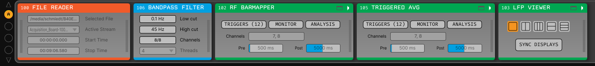
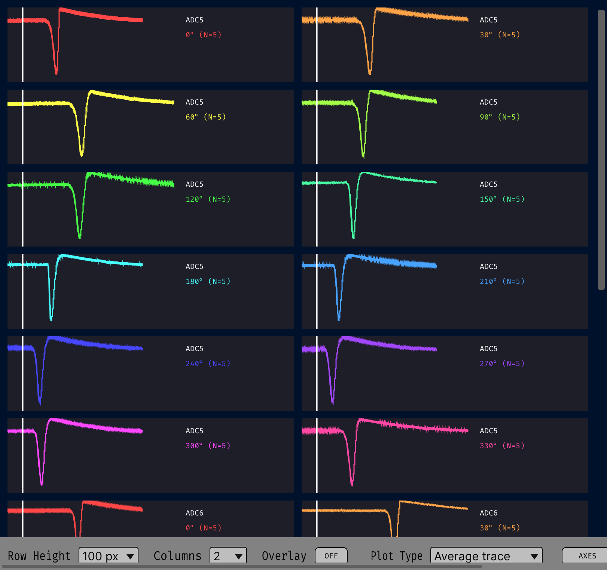

# Getting started

A first triggered average, from an empty signal chain. The same steps set up any of the
four plugins — only what the canvas draws differs.

## 1. Put the plugin in a signal chain

Drag **Triggered Avg** from the processor list into the signal chain, downstream of
whatever produces your continuous data.

*Screenshot placeholder — see `Docs/assets/screenshots/README.md`.*
{: .placeholder }

Nothing here decimates or filters: what the plugin sees is what it averages. Put a
downsampling or filtering plugin upstream if you need one.

## 2. Select channels

Use the editor's channel selector. Nothing is selected by default, and with nothing
selected there is nothing to accumulate.

**This is the main cost lever** — everything downstream is linear in the number of
selected channels. Start with a handful.

## 3. Set the trial window

`Pre` and `Post`, in milliseconds, are the two boxes on the editor's bottom row,
defaulting to 500 ms and 1000 ms. Both are **locked during acquisition**, as is the
channel selection: changing either discards everything collected so far.

## 4. Define your conditions

Open **TRIGGERS** and add one row per experimental condition. Each row names a TTL line
and, optionally, three broadcast-message patterns.

*Screenshot placeholder — see `Docs/assets/screenshots/README.md`.*
{: .placeholder }

For a first run, one row with a TTL line and no message patterns is enough: it fires on
every rising edge of that line. The message patterns — arming a condition on a trial-type
message, committing or rejecting a trial on its outcome — are the subject of
[Triggers and messages](triggers.md), worth reading before a real experiment.

!!! tip "Type the table once"

    `SAVE` in the TRIGGERS popup writes the whole table to a small XML file, and `LOAD`
    reads one back in any of the four plugins.

## 5. Acquire, and watch MONITOR

Start acquisition. Trials accumulate and the canvas fills in. If nothing appears, open
**MONITOR**.

*Screenshot placeholder — see `Docs/assets/screenshots/README.md`.*
{: .placeholder }

**The stage where the count stops advancing is the stage that is broken:**

| Counters | What it means |
|---|---|
| `EDGES` stays at 0 | Nothing is arriving on that TTL line. Wrong line number, or the events are not reaching this plugin. |
| `EDGES` advances, `QUEUED` does not | The source is gated by an arm pattern and is never being armed. Check the pattern against the message text MONITOR shows. |
| `QUEUED` advances, `CAPTURED` does not | The worker gave up on the windows — usually triggers arriving faster than the window is long, or a stream that stopped advancing. |
| `CAPTURED` advances, nothing is kept | The source has a commit pattern and no commit message is matching, or the pending timeout is expiring first. |

Its *Log messages to console* toggle echoes every incoming broadcast message to the GUI
console along with the actions each source took from it, which is how patterns get shaped
against real message text.

## 6. Read the canvas

Open the visualizer (the tab or window button on the editor).

*Screenshot placeholder — see `Docs/assets/screenshots/README.md`.*
{: .placeholder }

One panel per selected channel, with each condition in its own colour. The options bar
sets the plot type, grid layout, overlay and axis limits — all display controls, none of
which discard data. `CLEAR` discards the accumulated trials and keeps the conditions.

## 7. Save the result

`SAVE` in the canvas's options bar writes a **session** — a directory holding one XML
manifest and one `.npy` per array, plus any exported figures. It works during
acquisition. `LOAD` restores a session, and is disabled while acquiring.

See [Saved sessions](sessions/index.md) for the format, and the
[Python](sessions/python.md) and [MATLAB](sessions/matlab.md) guides for reading one
outside the GUI.

## What to read next

- [Triggers and messages](triggers.md) — the arm/cancel/commit workflow.
- The page for the plugin you are using: [Triggered Average](plugins/triggered-average.md),
  [Triggered Power](plugins/triggered-power.md),
  [Triggered Coherence](plugins/triggered-coherence.md),
  [Receptive Field Bar Mapper](plugins/receptive-field-mapper.md).
- The [Parameter reference](reference/index.md).
