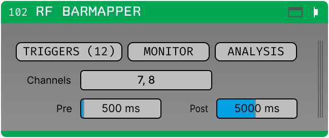
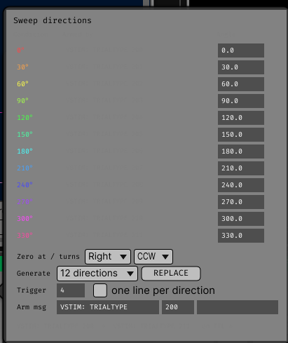
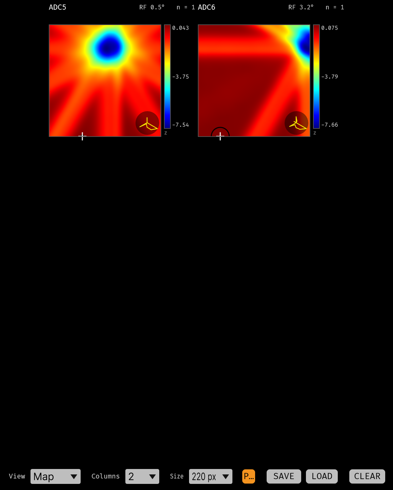
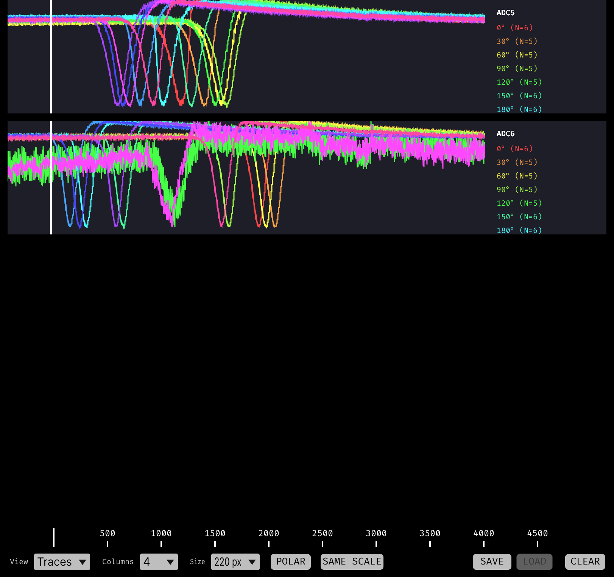

# Receptive Field Bar Mapper

Visual receptive fields, back-projected from the per-direction trial averages of a bar
swept across the screen. The method is that of Fiorani et al. (2014)[^fiorani], whose
Appendix A the implementation follows directly; section numbers below refer to that
paper.

One map per selected channel, updated while the run continues.

Appears in the GUI processor list as **`RF Barmapper`**. It needs no FFTW runtime.

[^fiorani]: Fiorani, Azzi, Soares & Gattass (2014), *Automatic mapping of visual cortex
receptive fields: a fast and precise algorithm*, J. Neurosci. Methods 221, 112–126.



## What it does

A bar sweeps across the screen at constant speed, in *N* directions. For one direction:

1. Trials are captured on a TTL edge at sweep onset and averaged, exactly as
   [Triggered Average](triggered-average.md) does — this plugin uses the same
   accumulators.
2. The average is **z-scored** against its own pre-trigger baseline, **smoothed**, and
   optionally **rectified** (§2.4.2–2.4.4).
3. Time is converted to **position along that bar's axis of travel**: the sample recorded
   at time *t* corresponds to the bar's centre at
   `(t − latency) · speed + sweep start`. That is the whole latency correction — an
   offset, nothing more.

That gives one *spatial profile* per direction: response as a function of how far the bar
had travelled. The bar is long, so a profile is a one-dimensional projection of the
receptive field.

**Back-projection** intersects those projections. A map point **x** is crossed by the bar
when the bar's centre has travelled `x · u`, where **u** is the unit vector along the
direction of motion, so the value that direction contributes at **x** is its profile read
at `x · u`. With enough directions the profiles intersect in one place — the receptive
field — and elsewhere they do not.

## How a direction reaches the plugin

| | |
|---|---|
| the trial-type **broadcast message** | **arms** the matching trigger source — see [Triggers and messages](../triggers.md) |
| a hardware **TTL edge at sweep onset** | provides the **alignment** |
| the **angle** each source stands for | is **typed in by the user**, and is the one thing nothing can verify |

## Getting a first map

1. **Select channels** in the editor.
2. **ANALYSIS → DIRECTIONS... → Generate → REPLACE.** This replaces the trigger sources
   with *N* evenly spaced directions, each armed by a trial-type message.
3. **Check the compass** under ANALYSIS: the angles are the one thing nothing can
   verify.
4. **ANALYSIS → set the speed, sweep start and latency** to match the stimulus program,
   then check that Pre/Post actually cover the sweep — see
   [Making the window and the sweep agree](#making-the-window-and-the-sweep-agree). The
   stock defaults do not.
5. Record. Maps appear as trials accumulate.

## DIRECTIONS...



One row per trigger source, showing what arms it and what angle it means, plus a
generator that replaces the sources with evenly spaced directions.

### The generator

Configure it to match the messages your stimulus program sends:

| Field | Default | What it sets |
|---|---|---|
| *Generate* | 8 | How many directions, evenly spaced around the circle |
| *Trigger* | 1 | The TTL line carrying sweep onset, numbered as in the trigger table (1-based) |
| *one line per direction* | off | off: every direction is armed on that one line and told apart by its message; on: line, line+1, line+2, … |
| *Arm msg* — text before | `TRIALTYPE ` | The text before the number |
| *Arm msg* — first number | `0` | The number for the first direction |
| *Arm msg* — text after | ` TIMESEQUENCE` | The text after it |

The number steps up by one per direction whether or not the TTL line does. For example,
`VSTIM: TRIALTYPE `, `200`, ` TIMESEQUENCE` generates `VSTIM: TRIALTYPE 200 TIMESEQUENCE`,
`… 201 …`, `… 202 …` — substitute whatever your own stimulus program sends.

A **preview line** under the fields shows the first and last pattern the current settings
would produce, and REPLACE repeats it in the confirmation.

The generator **replaces** rather than appends, so a generated set cannot silently mix
with directions left over from a previous one.

!!! danger "The trailing text is not decoration"

    `TRIALTYPE 3` also contains-matches `TRIALTYPE 30`, and a trial-end message that
    repeats the trial type would re-arm the source at trial end — making it fire on the
    *next* trial's edge, very likely a different direction, with nothing looking wrong.

    Pick trailing text that appears in the trial-start message and not in the trial-end
    one. Clear it only if your messages carry their own boundary.

The generator settings are saved with the signal chain.

### Angles

| Parameter | Default | What it does |
|---|---|---|
| **Zero at** | Right | Where the *stimulus program's* zero angle points: Right (+x), Up, Left, Down |
| **Angles turn** | Counter-clockwise | Which way increasing angles turn in the stimulus program |
| **Angle**, per condition | unset | Direction of motion for that condition, **in the convention above** |

Angles are stored exactly as typed and converted to a canonical form (0 = right,
counter-clockwise) only where they are used, so changing the convention **re-interprets**
the table rather than rewriting it.

!!! danger "Check the convention against your stimulus program"

    Conventions that differ by 180° — Fiorani et al.'s Appendix A uses *zero at left,
    counterclockwise* — produce a perfectly plausible and entirely wrong map. The compass
    preview redraws when the convention changes.

A condition with **no angle contributes nothing** to the map — it is not treated as 0°.
An angle left blank shows in orange in the table, and as a gap in the compass preview.

Three warnings are shown across the top of the canvas. All three can be legitimate, and
all three are more often a typo in the angle column:

- **duplicate angles** — two conditions claim the same direction;
- **uneven spacing** — the gaps around the circle are not all 360/*N*;
- **does not span the circle** — some gap exceeds 180°. Eight directions crammed into one
  quadrant are evenly spaced *and* useless: the profiles have nothing to intersect
  against, and the map degenerates into a ridge rather than a peak.

## ANALYSIS


!!! success "No parameter in this plugin discards data"

    Everything under ANALYSIS is re-read from the accumulated trials whenever it changes,
    so all of it stays **editable during acquisition**.

    The exceptions are the two capture parameters — Channels and Pre/Post — which *do*
    rebuild the accumulators and are locked while acquiring.

Four groups: display units (unit, viewing distance, screen resolution), stimulus geometry
(speed, sweep start, latency), how the response is read (smoothing, absolute z, combine),
and the map itself (size, resolution, centre, border). Two defaults are worth knowing:

- **Latency 60 ms.** Without it each direction's response is displaced *along its own
  direction of motion*, so opposite directions are displaced opposite ways and the
  combined field is inflated (their Fig. 3). Too large a latency inflates it the same
  way, in the other direction.
- **Border at 0.76 of the peak**, not half — the correction the paper measured (§3.1.1)
  for the enlargement smoothing and back-projection introduce.

Full list with defaults, ranges and what each one does to the map:
[Parameter reference → Receptive Field](../reference/receptive-field.md).

### Degrees, millimetres or screen pixels

**Show units in** at the top of ANALYSIS sets the unit for every linear quantity the
plugin shows or takes: Speed, Sweep start, Resolution, Map centre X/Y, the map axes and
the `RF` readout on each panel. Fill in **Viewing distance** and, for screen pixels,
**Screen resolution** — they are what the conversion needs, and they are saved with the
signal chain so the rig is typed in once.

!!! info "Display only, by construction"

    Degrees of visual angle remain the unit everything is computed, saved and exported
    in. The conversion happens in the parameter fields and the panel readouts, and the
    display parameters are the only ones in this plugin that do **not** trigger a
    recompute — switching to millimetres cannot move a receptive field or change a map
    pixel. What is typed is converted back to degrees and clamped against the
    parameter's own range, so the range does not change with the unit either.

    The factor is the small-angle one, `mm/deg = distance × π/180` — 9.95 mm/deg at the
    default 570 mm. It under-reports *position* by about 4% at 20° eccentricity; see the
    [parameter reference](../reference/receptive-field.md#display-units-analysis) for
    why one factor is used rather than a tangent for positions.

    A saved session keeps the `*_deg` arrays and attributes exactly as before, and now
    also carries `viewing_distance_mm`, `screen_px_per_mm` and `screen_mm_per_deg`, so
    an offline analysis can convert without being told the rig separately.

## Making the window and the sweep agree

This is the one thing that is easy to get wrong and produces an empty-looking map with no
warning anywhere. The bar is only followed for as long as the trial window lasts:

```
first sample of the profile:  (−pre − latency) · speed + sweep start
last  sample of the profile:  (post − latency) · speed + sweep start
```

The bar reaches the map centre at `t = latency − sweep start / speed`.

!!! warning "The stock defaults do not get there"

    At 10 deg/s from −15° with Post = 1000 ms, the profile covers −20.6° to −5.6° along
    the axis, while the default map covers ±10.05°. Everything outside the swept range is
    padded with zero — no evidence either way, which is what zero means once the traces
    are z-scored — so the map comes out flat or edge-heavy.

For a sweep that starts at −*S* and is followed symmetrically past the centre:

```
post_ms  ≥  2 · S / speed · 1000          (3000 ms for S = 15°, speed = 10 deg/s)
S        ≥  map size × resolution / 2     (10.05° for the default map)
```

If long windows are impractical, shrink the map instead — the map only has to cover the
part of the visual field the bar actually swept through.

## Canvas

Two views.

=== "Map"

    

    Each panel is one channel:

    - **Top left** — the channel name.
    - **Top right** — `RF 2.4°` (or `RF 24.2 mm`, `RF 87 px`, following **Show units
      in**) is the **equivalent diameter**: the diameter of a circle
      with the same area as the supra-threshold region (pixels at or above
      *Border* × peak). `n = 12` is the **smallest trial count across directions**, not
      the total.
    - **The map** — jet colour scale, blue (low) to red (high), the paper's own scale.
      Rows run top to bottom while visual-field *y* runs upwards; the flip is applied
      once.
    - **The axes**, along the bottom and down the left — ticks on round multiples in
      *visual-field* coordinates, with the unit in the shared corner. Ticks are chosen
      in whichever unit is being shown, so millimetres get round millimetres rather than
      the conversions of round degrees. The numbers thin out on a small panel, and the
      axes disappear entirely below roughly 110 px of map.
    - **The colour scale**, to the right — the ends and midpoint of the range in force,
      captioned with the unit: `z` for the arithmetic or geometric mean of per-direction
      z-scores, `|z|` when *Absolute z* is on, `z^n` for the plain product.
    - **Black circle and white cross** — the equivalent-diameter circle centred on the
      peak pixel.
    - **Polargram** (bottom right, toggled by **POLAR**) — each direction's profile
      sampled at the receptive-field centre (their Figs. 5E, 5F). Drawn flipped to match
      the map above it.

=== "Traces"

    

    The per-direction averages themselves, overlaid per channel, drawn by the same
    widgets Triggered Average uses.

    This is the diagnostic view: when a map looks wrong the cause is usually visible in
    the time courses — a direction with no trials, a response at the wrong latency, a
    baseline that never settled.

### Canvas controls

| Control | Effect |
|---|---|
| **View** | *Map* or *Traces*. |
| **Columns**, **Size** | Grid layout. Cells are square and sized from *Size*. |
| **POLAR** | Show the polargram inset. |
| **SAME SCALE** | One colour range across every panel, so a strong channel and a weak one look different. Off by default. |
| **CLEAR** | Discards accumulated trials, keeps the conditions. |
| **SAVE / LOAD** | [Sessions](../sessions/index.md), shared with the other triggered plugins. |

## Sessions

SAVE writes the accumulators — the same three arrays Triggered Average writes — plus the
finished maps and their measurements:

| Array | Shape | dtype | Contents |
|---|---|---|---|
| `maps` | (channels, pixels, pixels) | float32 | The back-projection maps |
| `map_estimates` | (channels, 7) | float64 | `peak, centre_x_deg, centre_y_deg, area_pixels, equivalent_diameter_deg, width_deg, height_deg` — the column names are also in the manifest under `map_estimate_fields` |
| `map_valid` | (channels,) | int32 | Whether each channel's mapping is usable |
| `map_channel_indices` | (channels,) | int32 | Global channel indices |

The map geometry (`map_pixels`, `map_degrees_per_pixel`, `map_centre_x_deg`,
`map_centre_y_deg`) is in the manifest, along with the viewing geometry the display units
use — `viewing_distance_mm`, `screen_px_per_mm` and the derived `screen_mm_per_deg`.
Everything else stays in degrees whatever unit is on screen, so a file does not depend on
what the window happened to be showing when it was written.

**LOAD ignores the stored maps** and recomputes from the restored accumulators, so what
is displayed matches the current settings.

The **sweep angles** travel with the session in the bundle's settings block, matched back
up by position on load.

!!! warning "Loading applies the file's angles, overwriting whatever is in the table"

    The angles are what the loaded trials *mean*; a session restored under a different
    angle assignment produces a plausible and wrong map.

## Cost

A recompute runs in the background and coalesces requests, so dragging a slider produces
a stream of maps rather than a backlog. For one channel with eight directions
over a 1.5 s window at 30 kHz and a 201² map: about 4 ms, near enough flat in the
smoothing sigma. Everything is linear in the channel count.

## Not wired up yet

- **The latency scan** (one back-projection per candidate latency) is implemented and
  tested, but has no button in the editor. Set *Latency* by hand for now.
- **Direction- and orientation-selectivity indices** are computed on every recompute and
  are neither displayed nor saved.
