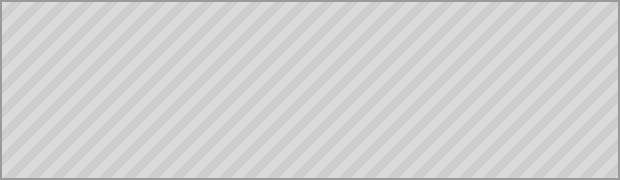

# Triggered Average

Time-domain average of continuous data around each trigger, split by condition, with the
standard deviation and the individual trials.

Appears in the GUI processor list as **`Triggered Avg`**. Links `average_core`, so it
needs no FFTW runtime.

*Screenshot placeholder — see `Docs/assets/screenshots/README.md`.*
{: .placeholder }

## What it computes

For each condition, a running mean and population standard deviation over trials, per
channel:

- the **average** is `sums / trial_count`;
- the **standard deviation** is the population one, over trials — divide by
  `sqrt(trial_count)` for the standard error;
- alongside them, a bounded ring of the most recent trials, kept for display only.

The accumulators are sums rather than averages, so folding a trial in is exact and a
resumed session continues the same estimate rather than an average of averages.

## Editor

| Control | Notes |
|---|---|
| **TRIGGERS** | The condition table — see [Triggers and messages](../triggers.md). |
| **MONITOR** | Per-source counters. Reads correctly for every stage; the double-counting fixed in 0.3.0 affected only this plugin. |
| **ANALYSIS** | One parameter: **Max Trials**. |
| **Channels** | Locked during acquisition. |
| **Pre / Post** | 500 ms and 1000 ms by default. Locked during acquisition. |

### ANALYSIS → Max Trials

**Individual trials retained per condition.** Default 10, range 1–50.

This is the depth of the per-condition ring the canvas draws individual traces from. It
does **not** limit how many trials go into the average — that is unbounded.

It resizes the per-condition trial buffers, so it is **locked during acquisition** and
changing it discards what has accumulated.

## Canvas

*Screenshot placeholder — see `Docs/assets/screenshots/README.md`.*
{: .placeholder }

One panel per selected channel, with each condition drawn in its own colour. Nothing in
the options bar discards data: these are display controls, applied when the display reads
the accumulators.

| Control | Effect |
|---|---|
| **Plot type** | `All traces`, `Average trace`, or `Average + All`. |
| **Columns** | Panels per row in the grid. |
| **Row height** | Panel height, 50–… px. |
| **Overlay** | Draw the conditions on shared axes rather than side by side. |
| **AXES** | Both axes' limits, in a popout — see below. |
| **CLEAR** | Discards accumulated trials, keeps the conditions. |
| **SAVE / LOAD** | [Sessions](../sessions/index.md). SAVE works during acquisition; LOAD does not. |

### AXES

Four numbers and two toggles that are set once and then left alone, so they live behind a
button rather than taking a third of the options bar away from the controls that are used
constantly.

| Control | Effect |
|---|---|
| **X-Axis (ms)** | `AUTO` fits the whole captured window; `MANUAL` uses the min and max typed beside it. The range is clamped to `[-pre_ms, post_ms]`, and the popout shows what that window currently is — a value outside it would otherwise produce a blank plot. |
| **Y-Axis (uV/V)** | `AUTO` scales each panel to its own data; `MANUAL` pins every panel to the range typed beside it. With it off, the average and the individual trials are normalised to the same range, so the average cannot appear to swing wider than the traces it was computed from. |

A range typed with its ends the wrong way round is not applied — an inverted axis draws an
empty panel, which looks exactly like a condition that never fired. Both ranges are kept
whether or not they are in use, so switching an axis back to `MANUAL` finds the numbers
last typed rather than the defaults.

The six axis-limit parameters are deliberately **not** analysis parameters: nudging an
axis must not throw away the session.

## Sessions

SAVE writes the accumulators plus what the canvas draws:

| Array | Shape | dtype | Contents |
|---|---|---|---|
| `sums` | (sources, channels, samples) | float32 | Summed trials — the resumable state |
| `sum_squares` | (sources, channels, samples) | float32 | Summed squares — the resumable state |
| `trial_counts` | (sources,) | int32 | Trials folded in per condition |
| `averages` | (sources, channels, samples) | float32 | `sums / trial_counts`, what the canvas drew |
| `standard_deviations` | (sources, channels, samples) | float32 | Population SD over trials |
| `time_ms` | (samples,) | float64 | The time axis, trigger at 0 |

The derived three are outputs, not state: LOAD ignores them and rebuilds the averages
from the sums. They are saved anyway because a session is also how the data leaves this
program, and someone reading it in Python or MATLAB should get the mean trace the canvas
drew without first working out that it is `sums / trial_counts` with the trigger at
sample `pre_samples`. The time axis in particular is the part that is easy to get quietly
wrong by one sample.

A condition with no trials is written as zeros rather than NaN, and `trial_counts` is
what says so.

**The single-trial ring is deliberately not saved.** It is a bounded ring of the most
recent trials kept for display, not part of the estimate: the averages do not depend on
it, and a resumed session whose ring held trials from before the break would show a
"recent trials" view spanning a gap of hours.

See [Saved sessions](../sessions/index.md).

## Parameters

Full list with defaults, ranges and scope: [Parameter reference → Triggered
Average](../reference/triggered-average.md).
