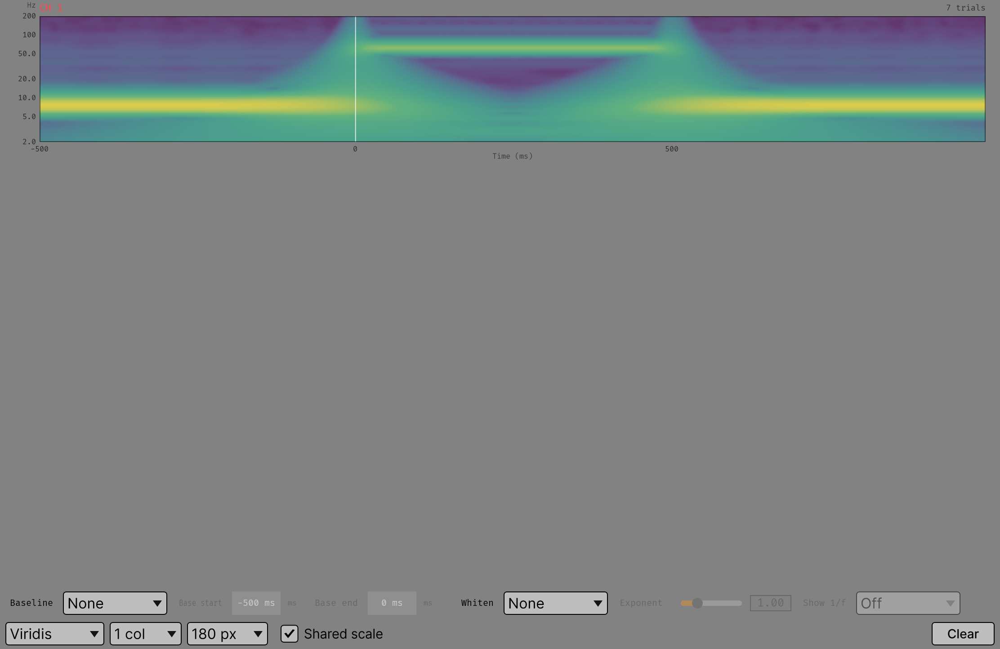
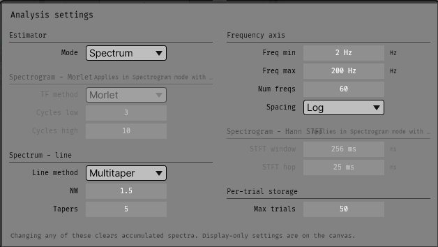

# Triggered Power

Power spectra locked to TTL or message triggers, accumulated across trials and split by
condition.

Appears in the GUI processor list as **`Triggered Power`**. It needs the
[FFTW runtime](../installation.md#installing-a-release) in the GUI's `shared` directory.

## Two display modes, two estimators

The **Mode** parameter picks between a time-resolved spectrogram and a single spectrum
per trial window, each with its own estimator.

=== "Spectrogram"

    A time-frequency map, averaged over trials.

    **Morlet wavelets** (default) or a **Hann STFT**. Morlet gives one estimate per
    trial with a frequency-dependent window: `Cycles low` at the lowest frequency rising
    to `Cycles high` at the highest, so low frequencies get time resolution and high
    frequencies get frequency resolution. The Hann STFT is a fixed sliding window —
    `STFT window` long, stepped by `STFT hop` — which is the right choice when you want
    one time resolution across the whole range.

    

    *Screenshot placeholder — see `Docs/assets/screenshots/README.md`.*
    {: .placeholder }

=== "Spectrum"

    One tapered periodogram over the whole trial window, averaged over trials with the
    per-trial lines retained.

    **DPSS multitaper** (default) or a single **Hann** taper. Multitaper trades frequency
    resolution for variance: `NW` is the time-bandwidth product, and `Tapers` is how many
    of the resulting DPSS sequences are used. `2·NW − 1` is the usual choice; the
    defaults are NW 3 and 5 tapers.

    

    *Screenshot placeholder — see `Docs/assets/screenshots/README.md`.*
    {: .placeholder }

## ANALYSIS

Everything behind ANALYSIS reshapes the accumulators, so all of it is **locked during
acquisition** and changing any of it discards what has accumulated.

*Screenshot placeholder — see `Docs/assets/screenshots/README.md`.*
{: .placeholder }

| Group | Parameters | Applies when |
|---|---|---|
| **Estimator** | Mode | always — everything else's greying depends on it |
| **Frequency axis** | Freq min, Freq max, Num freqs, Spacing | always |
| **Spectrogram — Morlet** | TF method, Cycles low, Cycles high | Spectrogram mode, TF method = Morlet |
| **Spectrogram — Hann STFT** | STFT window, STFT hop | Spectrogram mode, TF method = Hann STFT |
| **Spectrum — line** | Line method, NW, Tapers | Spectrum mode |
| **Per-trial storage** | Max trials | Spectrum mode |

A greyed group says what would have to change for it to apply.

Defaults and ranges: [Parameter reference → Spectral](../reference/spectral.md).

## Canvas

All the canvas controls are **display-time**: applied when the display reads the
accumulators, so none of them discards a trial.

| Control | Effect |
|---|---|
| **Colour map** | `Viridis`, `Magma`, `Diverging` (blue-white-red, for signed data such as dB change) or `Greyscale`. |
| **Columns**, **Panel height** | Grid layout. |
| **Baseline** | `None`, `dB change`, `Percent change` or `Z-score`, against the window set by *Base start* and *Base end*. |
| **Whiten** | `None`, `Fixed exponent` or `Fitted 1/f`. |
| **Show 1/f** | Plot the un-whitened spectrum with the aperiodic background drawn over it. Spectrum mode only. |
| **CLEAR** | Discards accumulated trials, keeps the conditions. |

There are no SAVE / LOAD buttons here: this plugin does not write sessions — see below.

### Baseline

`Base start` and `Base end` are relative to the trigger, so the default window is
−500 ms to 0 ms: the pre-trigger stretch.

!!! note "In Spectrum mode the baseline does change what is estimated"

    It splits the trial window. It stays on the canvas because that is where it is used.

### Whitening

Removes the aperiodic 1/f background. `Fixed exponent` multiplies by `f^exponent`, which
is cheap and predictable when the exponent is known. `Fitted 1/f` fits the aperiodic
component (`log10 P = offset − exponent · log10 f`) and divides it out.

**Turn `Show 1/f` on while tuning the exponent.** The panel then plots the raw spectrum
with the line that would be removed drawn over it, so the slider has something to aim at.

## Sessions

**Not implemented.** The canvas carries no SAVE / LOAD buttons. The shared session
machinery is in place; the gather/apply for the spectral accumulators is not.

Triggered Average and the Bar Mapper do write sessions; see
[Saved sessions](../sessions/index.md).

## Parameters

Full list with defaults, ranges and scope:
[Parameter reference → Spectral](../reference/spectral.md).
