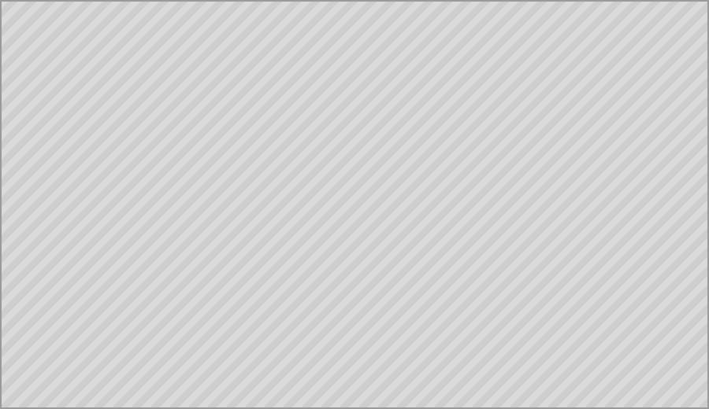

# Triggers and messages

Every plugin in this repository shares one model of *what a condition is* and *when it
fires*. This page is that model. It applies unchanged to Triggered Average, Triggered
Power, Triggered Coherence and the Receptive Field Bar Mapper.

## A trigger source is one condition

A **trigger source** is one experimental condition. TTL edges captured for it accumulate
into its own average, its own spectra, its own direction of the map — so a source is
equivalently "one condition" in the display, drawn in its own colour.

Sources are configured under the editor's **TRIGGERS** button.



*Screenshot placeholder — see `Docs/assets/screenshots/README.md`.*
{: .placeholder }

| Column | What it is |
|---|---|
| **Name** | The condition's label in the display. Purely cosmetic — nothing matches against it. |
| **TTL** | The TTL line whose rising edges fire this source. |
| **Color** | The colour it is drawn in. |
| **Arm MSG** | Broadcast-message pattern that arms the source. Empty = the source is not gated and fires on every edge. |
| **Cancel MSG** | Pattern that disarms it, and throws away a capture still waiting to be committed. |
| **Commit MSG** | Pattern that folds a waiting capture into the accumulators. Empty = captures are accumulated immediately. |
| **Timeout** | Milliseconds a provisional capture is held before it is discarded. Default 5000. Zero disables expiry. |

The table is disabled during acquisition: adding or removing a source reallocates its
accumulators.

## The three patterns

| Pattern | Effect |
|---|---|
| **Arm** | Gates the source: it fires on the next TTL edge only, once per arming |
| **Cancel** | Disarms, and throws away a capture still waiting to be committed |
| **Commit** | Folds a waiting capture into the accumulators |

### Setting an arm pattern is what makes a source gated

There is no trigger-type to choose. A source with **no** arm pattern fires on every
rising edge of its line, and MONITOR shows it as `live`. Give it one and it fires only
after an arming message, once per arming, shown as `armed` / `disarmed`.

This mirrors the commit pattern, where setting one is what makes captures provisional.
Two ways to say the same thing could disagree — a source marked "TTL + Message" with an
empty arm pattern could never fire at all — so there is now one. (0.2.x signal chains
with `TTL_AND_MSG` sources load as plain TTL sources carrying the arm patterns they
already had.)

### Setting a commit pattern is what makes a capture provisional

With a commit pattern set, the trial is captured on the TTL edge and then **held** —
parked in a per-source pending slot — until one of three things happens:

1. a **commit** message arrives, and it is folded into the accumulators;
2. a **cancel** message arrives, and it is discarded;
3. its **timeout** expires, and it is discarded.

That is how a trial can be rejected *after the fact*, on an outcome the task only knows
about at trial end.

!!! warning "The timeout has to outlast the gap between the edge and the commit message"

    **It defaults to 5000 ms.** Set too short, it reads as trials going missing — MONITOR
    names that case directly when commit messages match and nothing is kept. The old
    2000 ms default was shorter than the gap between a sweep's TTL edge and the trial-end
    message that commits it in a typical mapping run, so the last trials of a block were
    dropped.

Parking a capture **replaces** whatever the source was already holding. A trial that is
never committed is therefore evicted by the next one, and the timeout is only the
backstop for the last trial of a run.

## How patterns match

**Plain case-insensitive substring matches.** No wildcards, no regular expressions, no
alternation. An empty pattern is disabled rather than matching everything.

When one message matches both a cancel and a commit pattern, **cancel wins**. Arming,
however, is applied last and **survives a cancel in the same message**.

That last rule is what makes the usual recipe work.

## The usual recipe

Given a task that broadcasts `... TRIAL_START <n> ...` and
`... TRIAL_END <n> ... OUTCOME <code> ...`, and keeping only outcome 0:

| Arm | Cancel | Commit |
|---|---|---|
| `TRIAL_START` | *(empty)* | `OUTCOME 0 ` |

A trial end commits only on the wanted outcome. Any other outcome matches nothing, and
that capture is evicted by the next trial's. Timeout is the backstop for the last trial
of a run.

!!! danger "Note the trailing space in the commit pattern"

    Without it, `OUTCOME 07` also matches `OUTCOME 0`. Substring matching has no notion
    of a word boundary, so **any pattern ending in a number needs its own boundary**.
    This is the single commonest way to get a plausible wrong answer out of these
    plugins.

### Do not cancel on the trial-start message

**When the TTL pulse marks the trial start, a cancel pattern on the trial-start message
discards every trial.**

The pulse reaches the plugin in microseconds; the message travels through the message
centre and arrives a block or more later — i.e. *after* the capture it was supposed to
protect. So the cancel discards that trial's own capture, and nothing is ever kept.

Cancel patterns are for messages that either precede the trigger or report an outcome
directly (`TRIAL_ERROR`). Relying on eviction plus the timeout is otherwise simpler and
correct.

## Message-only triggering is deliberately not implemented

Broadcast messages arrive over HTTP and are unreliable in their timing, so a
message-only trigger cannot carry a trustworthy trigger sample. The extension point is
kept (`TriggerType::MSG_TRIGGER`) for anyone who does not need alignment precision, and
is not offered in the UI
([#11](https://github.com/brain-bremen/event-triggered-analysis/issues/11)).

## Copying a trigger table between plugins

The TRIGGERS popup's **SAVE** and **LOAD** buttons move the whole table — names, TTL
lines, colours, the three patterns and the timeout — as a small XML file.

A rig normally runs several of these plugins off the same conditions, and retyping a
dozen message patterns identically into four tables is the easiest place in these plugins
to introduce a mismatch nothing would report.

LOAD also accepts a **saved signal chain** (`.xml` from the GUI), whose
`CUSTOM_PARAMETERS` block holds the same `TRIGGERSOURCE` elements, so a table can be
lifted straight out of a chain someone else set up. It:

- **replaces** the current table rather than merging into it;
- is **disabled during acquisition** — reloading the table reallocates every per-source
  accumulator;
- **refuses a file with no trigger sources in it** rather than silently emptying the
  table.

In the **Bar Mapper** the sweep angles and the direction generator's settings travel with
the table, so a direction set arrives meaning what it meant where it was saved rather
than as eight unlabelled conditions.

??? example "What the file looks like"

    ```xml
    <TRIGGERSETTINGS plugin="Triggered Avg" savedAt="2026-08-24T14:31:07+0200">
      <TRIGGERSOURCE name="Attend in"
                     line="0"
                     type="1"
                     colour="ffe6b422"
                     armPattern="TRIALTYPE 200 TIMESEQUENCE"
                     cancelPattern=""
                     commitPattern="OUTCOME 0 "
                     pendingTimeoutMs="5000"/>
      <TRIGGERSOURCE name="Attend out" line="0" type="1" colour="ff3f9ad9"
                     armPattern="TRIALTYPE 201 TIMESEQUENCE"
                     cancelPattern="" commitPattern="OUTCOME 0 "
                     pendingTimeoutMs="5000"/>
    </TRIGGERSETTINGS>
    ```

    The same `TRIGGERSOURCE` elements appear in a saved signal chain and in a saved
    session's `session.xml`, written by one serialiser, which is why all three are
    interchangeable as LOAD input.

## MONITOR

The **MONITOR** popup shows what is actually happening.


*Screenshot placeholder — see `Docs/assets/screenshots/README.md`.*
{: .placeholder }

Per source, the counters for each stage a trial passes through:

| Counter | Counts |
|---|---|
| `EDGES` | Rising edges on this source's line, counted **before** the arm gate — so an edge that arrived but did not fire is still visible |
| `QUEUED` | Edges that passed the gate and were handed to the worker |
| `DROPPED` | Edges dropped because the work queue was full |
| `CAPTURED` | Trial windows the worker extracted and transformed |
| `FAILED` | Windows the worker gave up on — too old, or the stream stopped advancing |
| `COMMITTED` | Parked captures folded in by a commit message |
| `ARM` / `CANCEL` / `COMMIT` | Messages that **matched** each pattern |

The message counters count *matches*, not *actions taken*: a message hitting both a
cancel and a commit pattern increments both, while only the cancel takes effect. That
difference is the whole diagnosis for "my commit message is being ignored", which is why
they are not collapsed into one "what happened" column.

Alongside them: the TTL and broadcast-message totals, the text of the last message, a
console-echo toggle, and a one-line diagnosis of the commonest failures.

## Which parameters are locked during acquisition

Anything that reshapes the accumulators, because changing it discards what has been
collected:

- the **channel selection**, `Pre` and `Post`, in every plugin;
- the **trigger table** itself — adding, removing or loading sources;
- each plugin's own analysis parameters (Triggered Average's `Max Trials`, all of the
  spectral estimator settings, Coherence's shift predictor).

Anything that only changes how accumulated data is drawn stays live: axis limits, colour
maps, grid layout, Triggered Power's baseline and whitening, Coherence's display mode and
smoothing, and **every** parameter of the Bar Mapper except the capture window. The
plugin pages say which is which, and so does the
[Parameter reference](reference/index.md).
