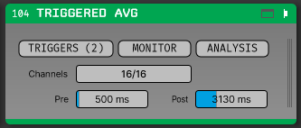
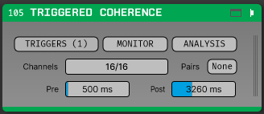
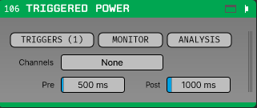

# Event-Triggered Analysis

Plugins for the [Open Ephys GUI](https://github.com/open-ephys/plugin-GUI) that analyse
continuous data in windows locked to an event — a TTL edge, a broadcast message, and in
time spikes.

Four plugins are built from this repository:

| Plugin | Status | What it shows |
|---|---|---|
| **Triggered Power** | | Power spectra locked to TTL/message triggers, accumulated across trials and split by condition |
| **Triggered Coherence** | **WIP** | Magnitude-squared coherence and coherency phase for configured channel pairs |
| **Triggered Average** | | Time-domain average and standard deviation, with individual trials |
| **Receptive Field Bar Mapper** | | Visual receptive fields, back-projected from the per-direction trial averages of a sweeping bar |

> **Triggered Coherence is work in progress and should not be relied on for results yet.**
> It builds, loads and computes, but two things are known to be wrong or missing:
>
> - **No pre-trigger baseline** ([#16](https://github.com/brain-bremen/event-triggered-analysis/issues/16)),
>   so it cannot show change-from-baseline. Unlike whitening, this is meaningful for coherence.
> - **Pair edits are not undoable** ([#14](https://github.com/brain-bremen/event-triggered-analysis/issues/14)),
>   and removing a pair discards its accumulated cross-spectra.
>
> The estimator itself is tested numerically. The shift predictor and PPC exist precisely because
> coherence is easy to over-read — see the caveat under *Design notes* — so check the trial count
> and the shift predictor before believing a result.

<div align="center">

| Triggered Average | Triggered Coherence | Triggered Power |
|:---:|:---:|:---:|
|  |  |  |

</div>

They share four static cores, layered:

- **`trigger_core`** — the ring buffer, trigger sources, work queue, capture worker and the whole
  broadcast-message path, plus the trigger configuration and monitor windows. No FFTW, no DSP:
  everything about *getting* a trial window, and nothing about what is computed from it.
- **`average_core`** — the single-trial ring, the running mean/SD accumulator, the per-source data
  store and the trace display widgets. Layered on `trigger_core`, no FFTW. Used by Triggered
  Average and by the Receptive Field Bar Mapper, which want the same accumulators and do entirely
  different things with them.
- **`spectra_core`** — FFTW, DPSS tapers, Morlet wavelets, the accumulators and the spectral
  display widgets. Used by the two frequency-domain plugins only.
- **`rf_math`** — the receptive-field back-projection: response profiles, the map, the metrics.
  Layered on nothing at all — no JUCE, no Open Ephys, no FFTW — so it is testable and readable
  without a GUI in sight.

Each plugin still builds and installs as its own binary.

The two spectral plugins support two display modes:

- **Spectrogram** — a time-frequency map from Morlet wavelets (or a Hann STFT), averaged over trials.
- **Spectrum** — one tapered periodogram over the whole trial window, using DPSS multitaper
  (or a single Hann taper), averaged over trials with per-trial lines retained.

Morlet wavelets are the right tool for the time-resolved view but wasteful when collapsing to a
single spectrum, which is why the two modes use genuinely different estimators behind a common
interface.

## Receptive Field Bar Mapper

A bar sweeps across the screen in several directions; the plugin averages the trials of each
direction, converts each average from time to position along that bar's axis of travel, and
back-projects the result into one map of the visual field — the method of Fiorani et al. (2014),
whose Appendix A the implementation follows directly. One map per selected channel, updated
while the run continues.

A direction reaches the plugin through three mechanisms, deliberately kept apart:

- the trial-type **broadcast message arms** the matching trigger source, using the arm-pattern
  machinery every plugin here has (see *Triggers and messages* below);
- a hardware **TTL edge at sweep onset** provides the alignment, because a message cannot carry a
  trustworthy trigger sample;
- the **angle** each source stands for is typed in by the user, and is the one thing nothing can
  verify.

So the plugin parses no messages and knows no message grammar. It does own the angle table, under
**SWEEPS**: one row per trigger source, showing what arms it and what angle it means, with a
*Generate N directions* button that replaces the sources with evenly spaced directions bound to
consecutive trial types. Angles are entered in the stimulus program's own convention — a zero
direction and a rotation sense, defaulting to VStim's *0 = rightward, counter-clockwise* — and
converted to a canonical form at the boundary, so changing the convention re-interprets the
numbers in the table rather than rewriting them. Fiorani et al. put zero at the left, which is
exactly 180 degrees away, and that is the error that produces a perfectly plausible wrong map.
Duplicate angles, uneven spacing and a set that does not span the circle are flagged as warnings,
never errors: all three are legitimate, and all three are more often a typo.

**ANALYSIS** holds everything numerical: bar speed, the bar's position at the trigger, the
neuronal latency subtracted before time becomes space, the map's size, resolution and centre, the
smoothing sigma, how directions are combined (arithmetic mean, geometric, or plain product) and
the border fraction. Two defaults are worth knowing:

- **Latency 60 ms.** Without it the response is displaced along the direction of motion, and
  averaging opposite directions turns that displacement into an overestimated receptive field.
- **Border at 0.76 of the peak**, not half: smoothing and the back-projection both enlarge the
  mapped field, and the paper measured that fraction as the correction.

The canvas has two views. **Map** draws one map per channel, labelled with the equivalent
diameter of the mapped field, the peak z-score and the trial count, and optionally with a
polargram of the per-direction responses. **Traces** draws the direction averages themselves,
with the same widgets Triggered Average uses — it is not a lesser view, it is the one that
answers *why does the map look like that*, since
a direction with no trials, a response at the wrong latency or a baseline that never settled is
visible there and invisible in the map.

Each map is measured: peak and peak position, the supra-threshold area, its equivalent diameter
and bounding box, and direction- and orientation-selectivity indices from the per-direction
responses. Those go into the session file along with the accumulators, so reading a session in
Python or MATLAB does not mean reimplementing the pipeline. The equivalent diameter is reported
instead of a fitted ellipse axis on purpose: back-projection is not suitable for receptive-field
*structure*, only for its position and extent.

A latency scan (one back-projection per candidate latency) exists in `rf_math` and on the node, but
has no button in the editor yet.

## Design notes

- **All per-trial work runs on a background thread.** `process()` only appends to a lock-free ring
  buffer and enqueues a capture request; the worker extracts the trial window and transforms it.
  Broadcast messages arrive on the audio thread too, so arming happens there — it is one atomic
  store — while committing and discarding are queued to the worker.
- **No decimation here.** Put a downsampling plugin upstream in the signal chain if you want to
  analyse a reduced sample rate.
- **Channel selection is the main performance lever**, since cost is linear in selected channels.
- Coherence is only meaningful pooled over trials — a single trial has coherence 1 by
  construction. The display shows the trial count and the significance threshold.
- The receptive-field mapping runs on its own compute thread, off the accumulators, so map
  settings can be changed and the map recomputed without recapturing anything.

## Triggers and messages

A trigger source is one condition: TTL edges captured for it accumulate into its own spectra.
Sources are configured under **TRIGGERS**, and each can carry three broadcast-message patterns:

| Pattern | Effect |
|---|---|
| Arm | Gates the source: it fires on the next TTL edge only, once per arming |
| Cancel | Disarms, and throws away a capture still waiting to be committed |
| Commit | Folds a waiting capture into the accumulators |

Setting a commit pattern is what makes a capture *provisional*: the trial is held until the commit
message arrives, a cancel message discards it, or its timeout expires. That is how a trial can be
rejected after the fact.

Patterns are **plain case-insensitive substring matches** — no wildcards, no regular expressions,
no alternation. An empty pattern is disabled rather than matching everything. When one message
matches both a cancel and a commit pattern, cancel wins; arming, however, is applied last and
survives a cancel in the same message.

That last rule is what makes the usual recipe work. Given a task that broadcasts
`... TRIAL_START <n> ...` and `... TRIAL_END <n> ... OUTCOME <code> ...`, and keeping only
outcome 0:

| Arm | Cancel | Commit |
|---|---|---|
| `TRIAL_START` | *(empty)* | `OUTCOME 0 ` |

A trial end commits only on the wanted outcome. Any other outcome matches nothing, and that
capture is evicted by the next trial's, since parking a capture replaces whatever the source was
already holding. Note the trailing space in the commit pattern — without it, `OUTCOME 07` would
also match. Timeout is the backstop for the last trial of a run.

**Do not cancel on the trial-start message when the TTL pulse marks the trial start.** The pulse
reaches the plugin in microseconds; the message travels through the message centre and arrives a
block or more later, i.e. *after* the capture it was supposed to protect — so the cancel discards
that trial's own capture and nothing is ever kept. Cancel patterns are for messages that either
precede the trigger or report an outcome directly (`TRIAL_ERROR`); relying on eviction plus the
timeout is otherwise simpler and correct.

**Setting an arm pattern is what makes a source gated.** There is no trigger-type to choose:
a source with no arm pattern fires on every rising edge and the monitor shows it as `live`; give
it one and it fires only after an arming message, once per arming, shown as `armed`/`disarmed`.
This mirrors the commit pattern, where setting one is what makes captures provisional. Two ways
to say the same thing could disagree — a source marked "TTL + Message" with an empty arm pattern
could never fire at all — so there is now one.

Triggering on a message *alone*, with no TTL line, is deliberately not implemented. Broadcast
messages arrive over HTTP and are unreliable in their timing, so a message-only trigger cannot
carry a trustworthy trigger sample. The extension point is kept (`TriggerType::MSG_TRIGGER`) for
anyone who does not need alignment precision.

The **MONITOR** popup shows what is actually happening: TTL edges and broadcast messages received,
per-source counts for each stage (edges → queued → trials, and arm / cancel / commit → kept), the
text of the last message, and a one-line diagnosis of the commonest failures. Its
*Log messages to console* toggle echoes every incoming message to the GUI console together with
the actions each source took from it, which is how patterns get shaped against real message text.

## Building

Expects to sit next to a built `plugin-GUI` checkout:

```
<root>/
  plugin-GUI/
  plugins/event-triggered-analysis/
```

Override with `-DGUI_BASE_DIR=<path>` or the `GUI_BASE_DIR` environment variable.

```sh
cmake -S . -B Build -G "Visual Studio 17 2022" -A x64
cmake --build Build --config Release
cmake --install Build --config Release
```

The install step copies the plugin DLLs into `plugin-GUI/Build/<config>/plugins` and the vendored
FFTW runtime into `plugin-GUI/Build/<config>/shared`.

### Tests

One binary per layer, plus one for the receptive-field node:

```sh
cmake -S . -B Build -DBUILD_TESTS=ON
cmake --build Build --config Release --target trigger_core_tests spectra_tests average_tests \
  rf_node_tests rf_math_tests
ctest --test-dir Build -C Release
```

`trigger_core_tests` links `trigger_core` and *not* `spectra_core`, which is what keeps the core
split honest: the day something FFTW-dependent is put on the wrong side of the line, that target
stops linking. `rf_math_tests` goes further and links neither JUCE nor the GUI at all, so the
mapping maths is tested as plain C++.

Enabling tests pulls the GUI in as a subproject to reuse its `gui_testable_source` and
`test_helpers` targets, so the first configure is slow.

## FFTW

FFTW3 (double precision) is vendored under `libs/`, copied from the `OpenEphysFFTW` common
library. It is discovered and installed by `Source/Spectral` rather than at the top level, so a
plugin that links only `trigger_core` never asks for it. The wrapper in `Source/Spectral/Fftw.h`
is local rather than reusing `OpenEphysFFTW`, which still uses `ScopedPointer` (removed in JUCE 8)
and has no batched-plan API.

Both spectral plugins load the *same* `libfftw3-3.dll`, and this build does **not** export
`fftw_make_planner_thread_safe`, so planning is serialised with a process-wide named lock. Plan
execution is thread-safe and is not serialised.

## Licence

GPL-3.0. See `LICENSE`.
