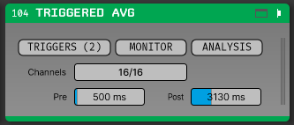
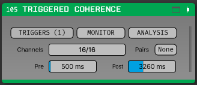
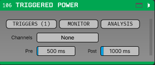

# Event-Triggered Analysis

Plugins for the [Open Ephys GUI](https://github.com/open-ephys/plugin-GUI) that analyse
continuous data in windows locked to an event — a TTL edge or a broadcast message.

📖 **[Documentation](https://brain-bremen.github.io/event-triggered-analysis/)** — every
parameter, the trigger and message model, and how to read a saved session in
[Python](https://brain-bremen.github.io/event-triggered-analysis/sessions/python/) or
[MATLAB](https://brain-bremen.github.io/event-triggered-analysis/sessions/matlab/). The
source is in [`Docs/`](Docs/), including the [changelog](Docs/changelog.md).

Four plugins are built from this repository:

| Plugin | Status | What it shows |
|---|---|---|
| **Triggered Power** | | Power spectra locked to TTL/message triggers, accumulated across trials and split by condition |
| **Triggered Coherence** | **WIP** | Magnitude-squared coherence and coherency phase for configured channel pairs |
| **Triggered Average** | | Time-domain average and standard deviation, with individual trials |
| **Receptive Field Bar Mapper** | | Visual receptive fields, back-projected from the per-direction trial averages of a sweeping bar |

> **Triggered Coherence is work in progress and should not be relied on for results yet.**
> It builds, loads and computes, and the estimator is tested numerically, but it has
> **no pre-trigger baseline** ([#16](https://github.com/brain-bremen/event-triggered-analysis/issues/16))
> and **pair edits are not undoable** ([#14](https://github.com/brain-bremen/event-triggered-analysis/issues/14)):
> removing a pair discards its accumulated cross-spectra. Check the trial count and the
> shift predictor before believing a result.

<div align="center">

| Triggered Average | Triggered Coherence | Triggered Power |
|:---:|:---:|:---:|
|  |  |  |

</div>

## Shared cores

Each plugin builds and installs as its own binary over four static cores:

- **`trigger_core`** — the ring buffer, trigger sources, work queue, capture worker and the
  broadcast-message path, plus the TRIGGERS and MONITOR windows. No FFTW, no DSP.
- **`average_core`** — the single-trial ring, the running mean/SD accumulator, the per-source
  data store and the trace display widgets. Used by Triggered Average and the Bar Mapper.
- **`spectra_core`** — FFTW, DPSS tapers, Morlet wavelets, the spectral accumulators and
  display widgets. Used by the two frequency-domain plugins only.
- **`rf_math`** — the receptive-field back-projection: response profiles, the map, the
  metrics. No JUCE, no Open Ephys, no FFTW.

The two spectral plugins have two display modes, with a different estimator behind each:

- **Spectrogram** — a time-frequency map from Morlet wavelets (or a Hann STFT), averaged over
  trials.
- **Spectrum** — one tapered periodogram over the whole trial window, using DPSS multitaper
  (or a single Hann taper), averaged over trials with per-trial lines retained.

## Receptive Field Bar Mapper

A bar sweeps across the screen in several directions; the plugin averages the trials of each
direction, converts each average from time to position along that bar's axis of travel, and
back-projects the result into one map of the visual field — the method of Fiorani et al.
(2014). One map per selected channel, updated while the run continues.

A direction reaches the plugin through three mechanisms:

- the trial-type **broadcast message arms** the matching trigger source, using the arm-pattern
  machinery every plugin here has;
- a hardware **TTL edge at sweep onset** provides the alignment;
- the **angle** each source stands for is typed in by the user, and is the one thing nothing
  can verify.

The angle table lives behind **ANALYSIS → DIRECTIONS...**: one row per trigger source, showing
what arms it and what angle it means, with a generator that replaces the sources with evenly
spaced directions armed by a pattern built from a prefix, a number and a suffix — for example
`VSTIM: TRIALTYPE `, `200` and ` TIMESEQUENCE` give `VSTIM: TRIALTYPE 200 TIMESEQUENCE`,
`… 201 …`, and so on — stepping the number by one per direction. A preview line shows the
first and last pattern it would produce.

**The trailing text is not decoration.** `TRIALTYPE 3` also contains-matches `TRIALTYPE 30`,
and a trial-end message that repeats the trial type would re-arm the source at trial end, so it
fires on the *next* trial's edge — very likely a different direction, with nothing looking
wrong. Pick text that appears in the trial-start message and not in the trial-end one.

Angles are entered in the stimulus program's own convention — a zero direction and a rotation
sense — and converted to a canonical form at the boundary, so changing the convention
re-interprets the table rather than rewriting it. Fiorani et al. put zero at the left, exactly
180 degrees from a rightward zero, and that is the error that produces a plausible wrong map.
Duplicate angles, uneven spacing and a set that does not span the circle are flagged as
warnings, never errors.

**ANALYSIS** holds bar speed, the bar's position at the trigger, the neuronal latency, the
map's size, resolution and centre, the smoothing sigma, how directions are combined and the
border fraction. Two defaults worth knowing: **latency 60 ms**, without which opposite
directions are displaced opposite ways and the combined field is inflated; and a **border at
0.76 of the peak** rather than half, the paper's empirical correction for the enlargement
smoothing and back-projection introduce.

Those linear quantities — speed, sweep start, resolution, map centre, the map axes and the
`RF` readout — can be shown in **degrees of visual angle, screen millimetres or screen
pixels**, selected at the top of ANALYSIS and converted from a viewing distance and a pixel
pitch that are saved with the signal chain. Degrees stay the unit everything is computed,
stored and exported in: the conversion happens in the parameter fields and the panel
readouts, and the display parameters are the only ones here that do not ask for a recompute,
so changing the unit cannot change a map. The factor is the small-angle one,
`mm/deg = distance × π/180`, which under-reports position by about 4% at 20° eccentricity.

The canvas has two views: **Map**, one map per channel labelled with the equivalent diameter,
the peak z-score and the trial count, optionally with a polargram; and **Traces**, the
direction averages themselves, which is where a direction with no trials or a response at the
wrong latency is visible.

Each map is measured — peak and peak position, supra-threshold area, equivalent diameter,
bounding box, and direction- and orientation-selectivity indices — and those go into the
session file along with the accumulators.

A latency scan exists in `rf_math` and on the node, but has no button in the editor yet.

Every parameter and how to make the trial window and the sweep agree:
[`Source/ReceptiveField/README.md`](Source/ReceptiveField/README.md).

## Triggers and messages

A trigger source is one condition: TTL edges captured for it accumulate into its own
accumulators. Sources are configured under **TRIGGERS**, and each can carry three
broadcast-message patterns:

| Pattern | Effect |
|---|---|
| Arm | Gates the source: it fires on the next TTL edge only, once per arming |
| Cancel | Disarms, and throws away a capture still waiting to be committed |
| Commit | Folds a waiting capture into the accumulators |

Setting a commit pattern is what makes a capture *provisional*: the trial is held until the
commit message arrives, a cancel message discards it, or its timeout expires (default 5000 ms;
zero disables expiry). That is how a trial can be rejected after the fact.

Patterns are **plain case-insensitive substring matches** — no wildcards, no regular
expressions. An empty pattern is disabled rather than matching everything. Cancel beats commit
on the same message; arming is applied last and survives a cancel in the same message.

The full model — the usual arm/commit recipe, why not to cancel on the trial-start message,
MONITOR's counters, and copying a trigger table between plugins with SAVE / LOAD — is in
[Triggers and messages](https://brain-bremen.github.io/event-triggered-analysis/triggers/).

## Sessions

**SAVE** and **LOAD**, at the right-hand end of the Triggered Average and Bar Mapper canvases,
write and resume what has been accumulated: a directory holding `session.xml` — provenance,
trial geometry, channels, the array index and the processor's configuration verbatim — plus one
`.npy` per array and any exported figures. The sums rather than the averages, which is what
makes it *resume* rather than *reload*.

Saving works during acquisition; loading does not, and a session that does not match the
current sample rate, trial window, channel count or trigger conditions is refused with the
reasons rather than half-applied.

Array tables, the manifest and worked examples:
[Sessions](https://brain-bremen.github.io/event-triggered-analysis/sessions/).

## Notes

- All per-trial work runs on a background thread. `process()` only appends to a lock-free ring
  buffer and enqueues a capture request; arming happens on the audio thread, while committing
  and discarding are queued to the worker.
- No decimation here. Put a downsampling plugin upstream if you want a reduced sample rate.
- Channel selection is the main performance lever: cost is linear in selected channels.
- Coherence is only meaningful pooled over trials — a single trial has coherence 1 by
  construction.
- The receptive-field mapping runs on its own compute thread, so map settings can be changed
  and the map recomputed without recapturing anything.

## Building

Expects to sit next to a built `plugin-GUI` checkout:

```
<root>/
  plugin-GUI/
  plugins/event-triggered-analysis/
```

Override with `-DGUI_BASE_DIR=<path>` or the `GUI_BASE_DIR` environment variable.

```sh
cmake -S . -B Build -G "Visual Studio 17 2022" -A x64
cmake --build Build --config Release
cmake --install Build --config Release
```

The install step copies the plugin DLLs into `plugin-GUI/Build/<config>/plugins` and the
vendored FFTW runtime into `plugin-GUI/Build/<config>/shared`.

### Tests

One binary per layer, plus one for the receptive-field node:

```sh
cmake -S . -B Build -DBUILD_TESTS=ON
cmake --build Build --config Release --target trigger_core_tests spectra_tests average_tests \
  rf_node_tests rf_math_tests
ctest --test-dir Build -C Release
```

Enabling tests pulls the GUI in as a subproject to reuse its `gui_testable_source` and
`test_helpers` targets, so the first configure is slow.

## FFTW

FFTW3 (double precision) is vendored under `libs/`. It is discovered and installed by
`Source/Spectral` rather than at the top level, so a plugin that links only `trigger_core`
never asks for it.

## Licence

GPL-3.0. See `LICENSE`.
